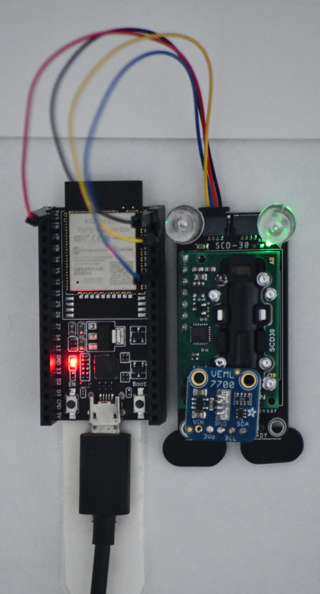

# Simple environmental sensor

Quick project that logs

* Temperature
* Relative humidity
* CO2 concentration
* Light intensity

to InfluxDB.

# Components

* [ESP32 dev kit](https://www.adafruit.com/product/3269)
* [SCD-30](https://www.adafruit.com/product/4867)
    * [STEMMA QT header cable](https://www.adafruit.com/product/4209)
* [VEML7700](https://www.adafruit.com/product/4162)

# Build

The VEML7700 (light sensor) stacks nicely on top of the SCD30.
I soldered the included 0.1" headers to the SCD30,
then laid the VEML7700 on top and soldered it down.
I bent the pins ever so slightly to deflect the light sensor
so it wouldn't directly cover the RH/temp sensor opening on the SCD30.

The (shoddily mounted) complete thing looks like this:

